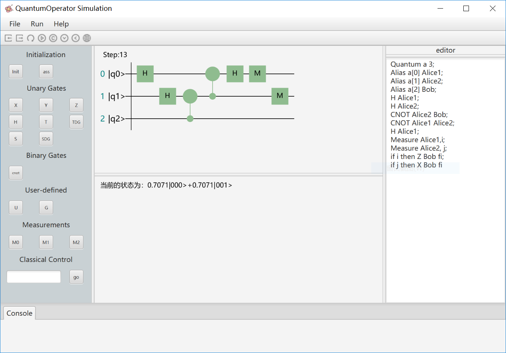

# Qsimulation V2.0: an Optimized Quantum Simulator
# Source code
You can clone the repository quantum and it can run in eclipse or intellij idea, you may need to add j-science libaray.
# Qsimulation V2.0 Grammer
<pre>
Program     --------> Declare { ; Statement }
Declare     --------> Quantum Identifier INT [Explist]
Statement  --------> Operator | Measurement | Show | Alias | IFStatement | Reset
Operator    --------> UnaryOp | BinaryOp | TernaryOp | MultiOp | GateOp | UOp
UnaryOp     --------> X|Y|Z|S|SDG|T|TDG Argument
BinaryOp    --------> CNOT Argument Argument
TernaryOp    --------> CCNOT Argument Argument Argument
MultiOp    --------> CNOTS [Argument ]
GateOp      --------> Gate[Explist] Argument
UOp         --------> U[Explist] Argument
Measurement--------> Measure [ Argument Identifier ]
Show        --------> Show
Alias       --------> Alias Argument, Argument
IFStatement---------> IF Bool Then Statement { ; Statement } FI
Reset       ---------> Reset
Bool       ----------> [!] Identifier
Argument   ---------> Identifier | Array
Explist    ---------> (Expression {, Expression})
Expression ---------> Factor [+|-|*|/ Expression]
Factor      ---------> [-] INT | Complex | Real

INT := [0-9]+
Real := [0-9]+\.[0-9]*
Complex := \< \-? Real \, \-? Real \>
Identifier := [a-zA-Z]*
Array := [a-zA-Z]*\[INT\]

</pre>
The list grammer has been used in the QSimulation. We will add some other grammer in the future.
# Qsimulation V2.0 statements
Statement  | Description 
:-|:-
Quantum Identifier INT	| Declare a quantum register named identifier with INT qubits.
Quantum Identifier INT Explist	| Declare a quantum register named identifier with INT qubits, and initialize the quantum register according to Explist.
X\|Y\|Z\|S\|SDG\|T\|TDG Argument	| single-qubit gate operation.
U[Explist] Argument	| Single quantum gate operation with parameters.
CNOT Argument Argument	| double-qubits gate operation.
CCNOT Argument Argument	Argument | triple-qubits gate operation.
CNOTS [Argument ] | multi-qubits gate operation.
Gate[Explist] Argument	| Custom quantum gate operation.
Measure 	| Global measurement of quantum states.
Measure [Argument Identifier ]	| Measurement of sub-states of quantum states.
Show	| Show the current state of the quantum register.
Reset	| Reset quantum register.
Alias Argument, Argument	| Alias an argument as the second argument.
IF Bool Then Statement { ; Statement } FI	| Classical judgment statement. Determine whether to execute the corresponding operation according to the measurement results.

# Qsimulation V2.0 Structure

# How to use

As you can see, the above picture is screenshot of QSimulation.    

## left pane
The black box area offers some buttons, which represent different functions.         

### initialization
- button 'Init'：initialization without parameters
- button 'ass': initialization with possibility ampitudes

### Unary Gates 
<pre>built-gate(without parameters)
  X        Y         Z        S     SDT          T           TDG 
|0 1|   |0  -i|   |1   0|   |1 0|  |1  0|  |1    0     |   |1     0     |
|1 0|   |i   0|   |0  -1|   |0 i|  |- -i|  |0 exp(iπ/4)|   |0 exp(-iπ/4)|

built-gate(with parameters) U(x,y,z)
            |exp(−i(φ+λ)/2)cos(θ/2)  -exp(−i(φ-λ)/2)sin(θ/2)|
U(θ,φ,λ) =  |                                               |
            |exp(i(φ-λ)/2)sin(θ/2)   exp(i(φ+λ)/2)cos(θ/2)  |
and the global phase is exp(i(φ+λ)/2)/cos(θ/2)

</pre>
### Binary Gate
<pre> Now, we only present a binary gate: CNOT, and we will offer some other universal matrix, such as CNOT-S.
        |1 0 0 0|
        |0 1 0 0|
cnot =  |0 0 0 1|
        |0 0 1 0| 
Although we don't present some other binary gate, we can constuct these.For example,
        |1 0 0 0|
        |0 0 1 0|
swap =  |0 1 0 0| 
        |0 0 0 1| 
swap[q1,q2] = cnot[q1,q2]cnot[q2,q1]cnot[q1,q2].  
</pre>
### Measurements
We only support 0-1 measure now, and we will offer some other measurements
### Classical control
input: number of executions 
It means we can test the program some times and QSimulation will offer the final distribution of statistics.
## nav
QSimulation presents some functions : import , save , restart, run, circuit, cirnext ,cirback, bloch

- import : you can import the program to the editor
- save : you can save the program 
- restart : you can restart the program 
- run : you can run the program
- circuit : you can generate the quantum circuit
- cirNext : you can debug the program
- cirBack : you can debug the program
- bloch: it can be simulated in bloch sphere

# Example
## quantum teleportation
<pre>
Quantum a 3;
Alias a[0] Alice1;
Alias a[1] Alice2;
Alias a[2] Bob;
H Alice1;
H Alice2;
CNOT Alice2 Bob;
CNOT Alice1 Alice2;
H Alice1;
Measure Alice1,i;
Measure Alice2, j;
if i then Z Bob fi;
if j then X Bob fi
</pre>

## quantum fourier transform
<pre>
Quantum q 3;
X q[2];
H q[0];
T q[1];
CNOT q[1] q[0];
TDG q[0];
CNOT q[1] q[0];
T q[0];
U(0,0,PI/8) q[2];
CNOT q[2] q[0];
U(0,0,-PI/8) q[0];
CNOT q[2] q[0];
U(0,0,PI/8) q[0];
H q[1];
T q[2];
CNOT q[2] q[1];
TDG q[1];
CNOT q[2] q[1];
T q[1];
H q[2];
CNOT q[0] q[2];
CNOT q[2] q[0];
CNOT q[0] q[2]
</pre>

## Grover algorithm
<pre>
Quantum a 4;
H a[0];H a[1];H a[2];X a[3];H a[3];
CNOTS a[0] a[1] a[2] a[3];
H a[0];H a[1];H a[2];X a[0];X a[1];X a[2];H a[2];
CCNOT a[0] a[1] a[2];
X a[0];X a[1];H a[2];H a[0];H a[1];X a[2];H a[2];
CNOTS a[0] a[1] a[2] a[3];
H a[0];H a[1];H a[2];X a[0];X a[1];X a[2];H a[2];
CCNOT a[0] a[1] a[2];
X a[0];X a[1];H a[2];H a[0];H a[1];X a[2];H a[2]
</pre>

## others
In folder examples, there are all the experiments and data of the paper.
